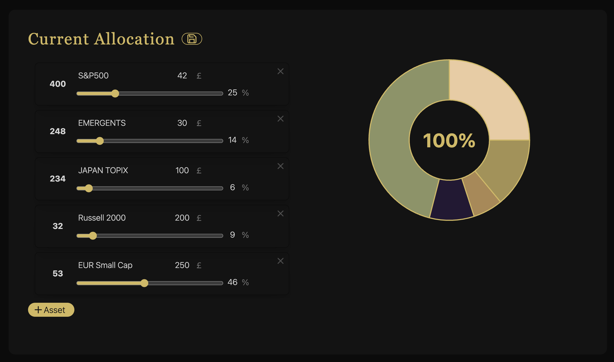
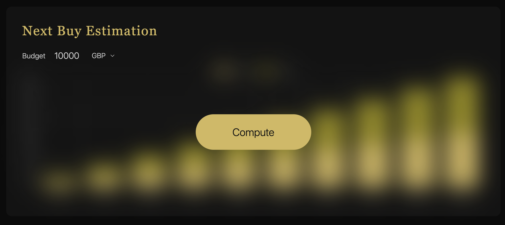
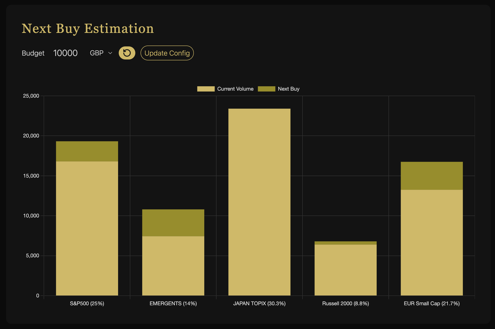

# FINANCES

## Introduction

FINANCES is a local Electron application designed for simple financial use cases. Built with Electron, React, TailwindCSS, Webpack, and TypeScript, this offline app offers multiple financial tools to assist with investing and potentially other financial aspects in the future. The app's primary feature is the Target Allocation Maintenance, which allows users to manage their asset allocation efficiently.

## Table of Contents

-   [Features](#features)
-   [Installation](#installation)
-   [Usage](#usage)
-   [Dependencies](#dependencies)
-   [Documentation](#documentation)
-   [Contributors](#contributors)
-   [License](#license)
-   [Contact Information](#contact-information)

## Features

-   **Target Allocation Maintenance**: Allows users to list all types of assets they possess, specify the desired percentage each asset should represent in their portfolio, input their budget, and then computes how much of each asset the user should buy next to achieve the desired distribution.
-   **Other Features**: More financial features will be added in the future.

## Installation

To install FINANCES, you'll need to have Node.js installed on your system. Follow these steps:

1. Clone the repository to your local machine.
2. Navigate to the project directory and run `npm install` to install all the necessary dependencies.
3. Once the dependencies are installed, you can build the project by running `npm run build`.
4. To start the application, run `npm start`.

## Usage

The FINANCES app features a user-friendly interface for managing and analyzing your financial portfolio through the Target Allocation Maintenance tool. Here's how to use it:

1. **Current Allocation**: Upon launching the app, you're greeted with the 'Current Allocation' section. This is where you'll add and review the assets in your portfolio. For each asset, you can input the amount you own and adjust the desired target percentage of your total portfolio that you wish for that asset to represent.

    

2. **Budget Input and Currency Selection**: Navigate to the 'Next Buy Estimation' section. Here, you'll find a budget input field where you can enter the amount of money you're planning to invest. You can also select the currency of your budget from the dropdown menu.

    

3. **Computation and Results**: After filling in your budget and currency, click the 'Compute' button. The app will then process your data and present you with a 'Next Buy Estimation' chart. This chart visualizes the amount of each asset you should buy next to align with your target allocation, based on your specified budget.

    

By following these steps, you can efficiently manage your financial portfolio to match your investment goals and preferences. This tool simplifies the decision-making process by providing clear visual aids and personalized data based on your financial strategy.

## Dependencies

FINANCES is built using several key technologies and libraries, including:

-   Electron (v28.1.3)
-   React (v18.2.0)
-   TailwindCSS (v3.4.1)
-   Webpack (v5.89.0)
-   TypeScript (v5.3.3)

For a full list of dependencies, refer to the `package.json` file's `devDependencies` and `dependencies` sections.

## Documentation

Further documentation detailing the technical aspects and architecture of FINANCES will be available [here](documentation/TECHNICAL-README.md).

## Contributors

-   Malo Le Mestre: @MaloLM (developer and owner of the repo)
-   El Walid Kadura: @wawkadura (full stack developer)

## License

This project is licensed under the ISC License. See the [LICENSE](LICENSE) file for more details.

## Contact Information

For any queries or contributions, please contact Malo Le Mestre at [malo.lm@icloud.com](mailto:malo.lm@icloud.com).
